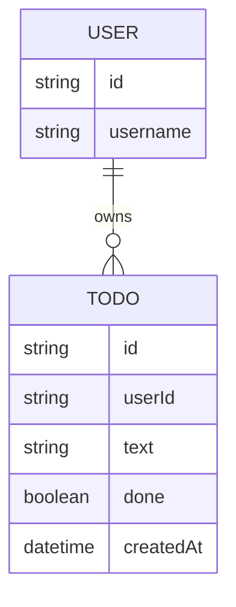

# Domain model

The app has one core entity, a Todo, always owned by exactly one signed-in User. Identity itself is managed by the platform's identity provider (Thunder); the domain model only needs the owning user's id to keep each list private.

- `USER` is not stored by this app — it is the signed-in identity Thunder asserts on every request. `userId` on `TODO` is that identity's id.
- `TODO.done` starts `false` and can only ever move to `true` — there is no path back to `false`, and there is still no delete.
- `TODO.text` can be changed while `done` is `false`; once `done` becomes `true`, `text` is locked and cannot be edited.

