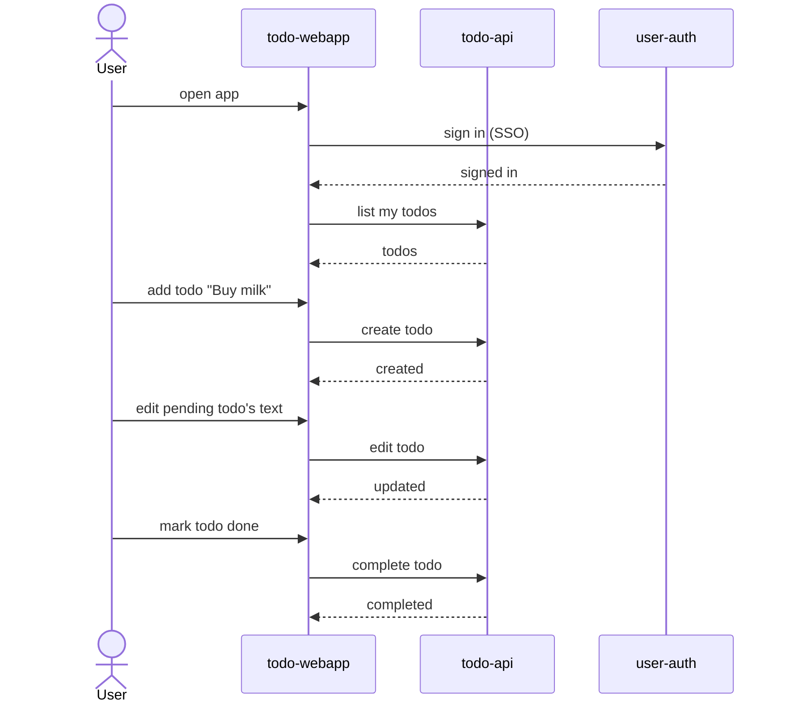

# Manage todos

A signed-in User adds a todo to their own list, edits it while it's still pending, and later marks it done.

```mermaid
sequenceDiagram
    actor User
    participant webapp as todo-webapp
    participant api as todo-api
    participant auth as user-auth

    User->>webapp: open app
    webapp->>auth: sign in (SSO)
    auth-->>webapp: signed in
    webapp->>api: list my todos
    api-->>webapp: todos
    User->>webapp: add todo "Buy milk"
    webapp->>api: create todo
    api-->>webapp: created
    User->>webapp: edit pending todo's text
    webapp->>api: edit todo
    api-->>webapp: updated
    User->>webapp: mark todo done
    webapp->>api: complete todo
    api-->>webapp: completed
```

